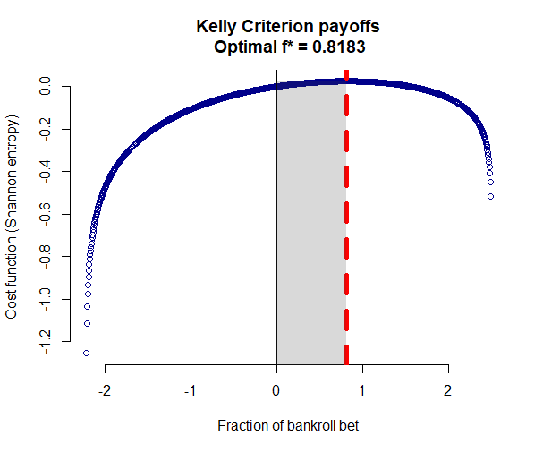

# Kelly-Criterion-optimal-betting
Calculates Kelly Criterion optimal bet size given vectors of probabilities and payoffs

In the example shown, a given investment strategy has the following payoffs:
* 10% probability of a 40% loss
* 20% probability of a 20% loss
* 30% probability of no net profit/loss
* 20% probability of a 25% gain
* 20% probability of a 45% gain

Given repeated bets, optimal Kelly Criterion betting is to bet 81% of your bankroll (see chart).

